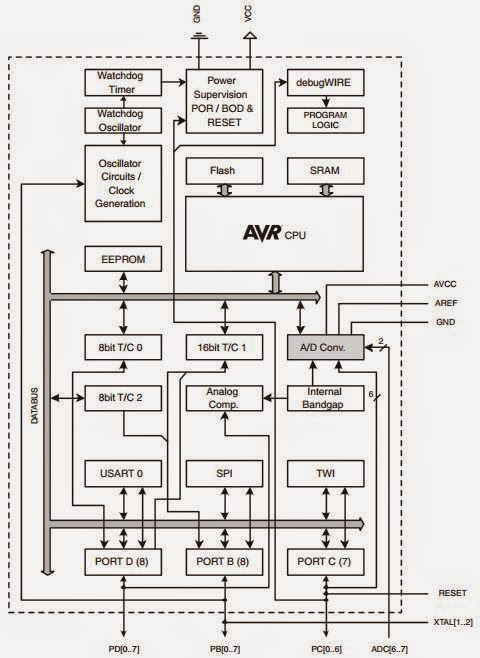
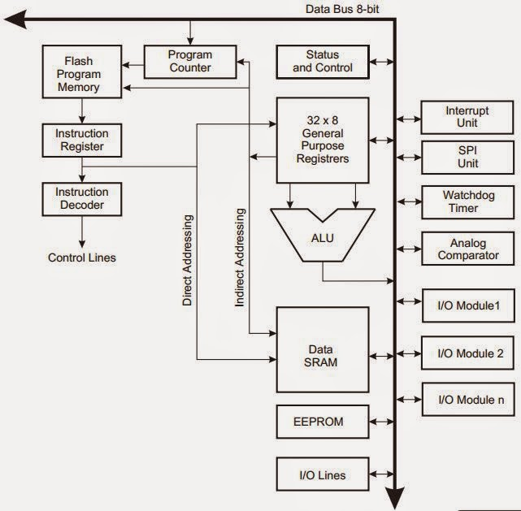
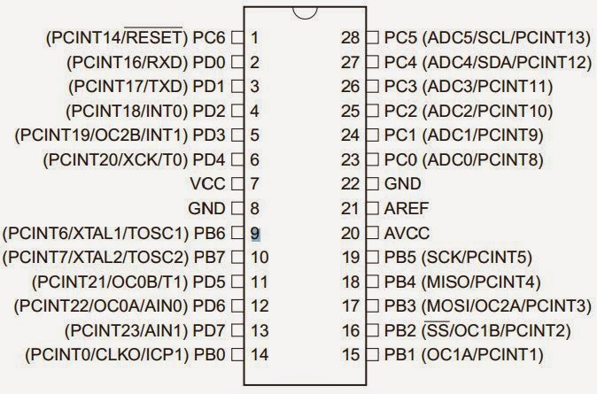

[Sitio del fabricante del procesador ATMEGA328](http://www.atmel.com/)

[Características del procesador ATMEGA328](http://www.atmel.com/devices/ATMEGA328.aspx)

# Diagrama en Bloques del Procesador

# Diagrama en Bloques de la CPU (interna al procesador)

# Diagrama de conexiones externas (ATMEGA328 chip)

# Diagrama de asignación en ARDUINO

