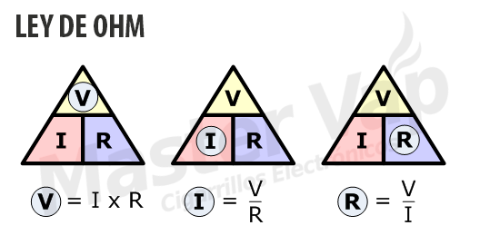
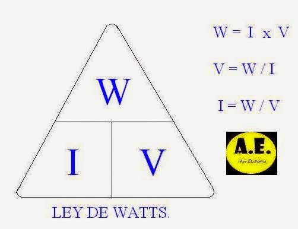

#RESUMEN

fuerza electromotriz
1. f. Electr. Causa capaz de generar una diferencia de potencial a través de los terminales de un circuito abierto.

diferencia de potencial
8. m. Electr. Magnitud, medida en voltios, que expresa la diferencia de tensión entre dos puntos de un circuito.

corriente eléctrica
1. f. Flujo de cargas eléctricas a través de un conductor.
2. f. Electr. Magnitud física que expresa la cantidad de electricidad que fluye por un conductor en la unidad de tiempo, y cuya unidad en el sistema internacional es el amperio.

##SIMBOLOS

##LEY DE OHM

##LEY DE WATT

